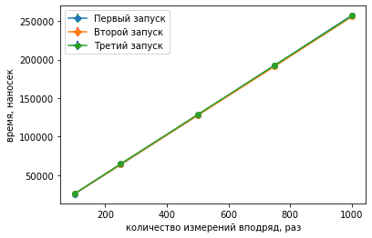
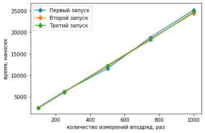
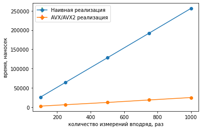
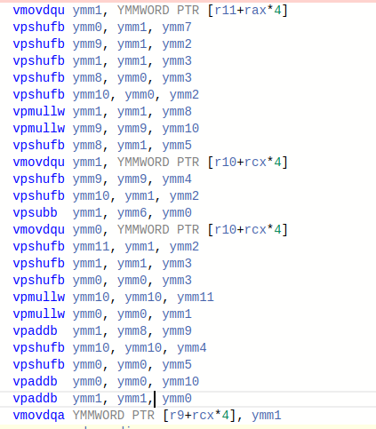
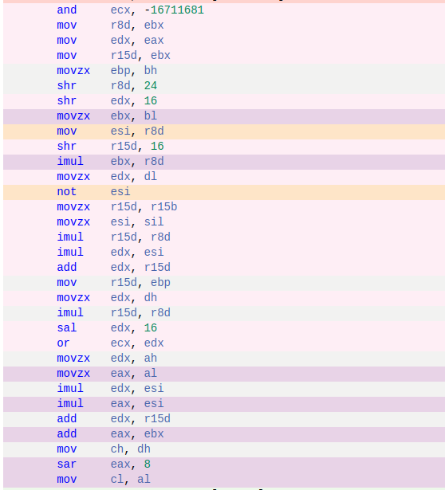
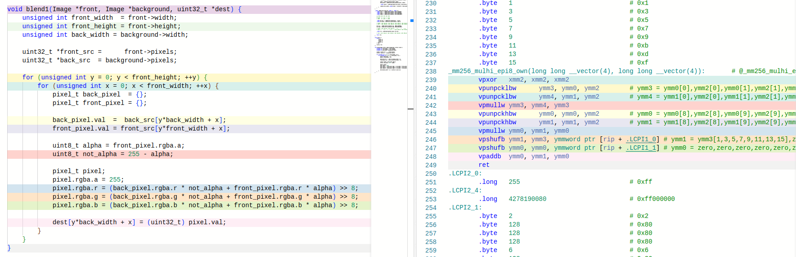
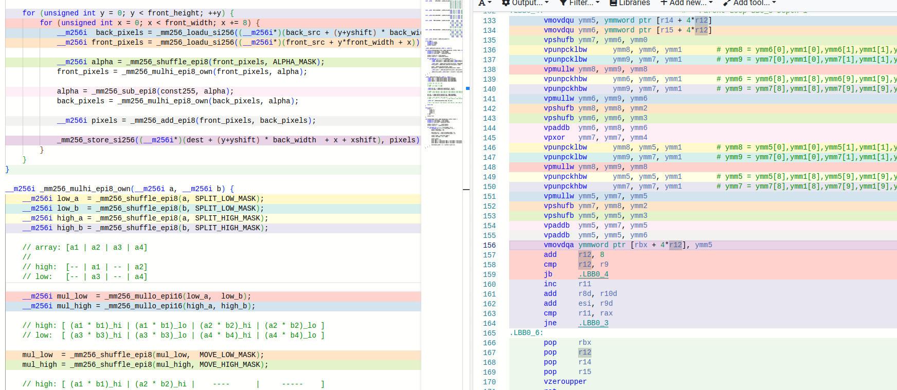
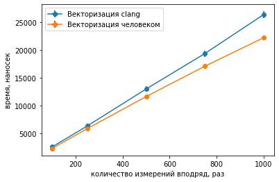

# Оптимизация альфа-блендинга при помощи AVX/AVX2

## Альфа-блендинг


Альфа-блендинг - комбинирование изображения с фоном с целью создания эффекта частичной прозрачности. Суть метода заключается в том, что всем пикселям переднего изображения помимо значений красного, зеленого и синего цветов присваивается значение прозрачности, называемое альфа-каналом. При объединении изображения с непрозрачным фоном вычисление значения цвета пикселя происходит по формуле:

$$X_{res} = X_{front} * A_{front} + X_{back} * (1 - A_{front}),$$

где $X_{front}, X_{back}, X_{res}$ - компоненты цветов изображения, фона и результата соответственно.

В данной задаче мы реализуем альфа-блендинг при помощи формулы выше, после чего оптимизируем его при помощи AVX и AVX2 интринсиков и сравним результаты.

## Общая информация

Характеристики ноутбука:

| Характеристики |                    |
|----------------|--------------------|
| OS             | Linux Mint 21      |
| CPU            | AMD Ryzen 7 5800H  |
| Compiler       | gcc 11.3.0         |

Флаги для сборки:
`-O3 -mtune=native -mavx -mavx2`

Измерения производятся при полной зарядке ноутбука с питанием от сети, параллельно никаких действий на ноутбуке не выполнется.

### Измерение времени

Измерение времени производится для функции вычисления значений пикселей результирующего изображения. Функция имеет прототип `void (Image *front, Image *background, uint32_t *dest)` во всех реализациях.

Вычисление производится несколько раз вподряд путем повторного вызова функции вычисления. Для всех повторений измеряется суммарное время. Значение числа вызовов определяется константами, которые будут указаны далее, измерения производятся для нескольких вариантов значений. После этого по этим значениям будут вычислены параметры аппроксимирующей прямой. Данный способ лучше вычисления по одной точке за счет того, что прямая может обладать смещением, которое испортит результат при непосредственном делении времени на все повторения на их количество. Так же, для повышения точности, для каждого числа повторений время усредняется по нескольким измерениям, вычисляется среднееквадратичное отклонение. 

### Константы для вычислений
Константы определены в заголовочном файле `common.h`.

| тип          | имя             | значение                              | смысл |
|--------------|-----------------|---------------------------------------|-------|
| const int    | ITERATIONS      | 1000                                  | Максимальное количество итераций вычисления точки последовательности, после которого вычисление прекращается.
| const int*   | COUNT_TIMES     | 100, 250, 500, 750, 1000         | Количество повторений вычисления значений массива между отрисовками.
| const int    | TIMES_SIZE      | sizeof(COUNT_TIMES) / sizeof(int) = 5 | Размер массива различных вариантов повторений.
| const int    | REPEAT_BENCH    | 100                                   | Количество повторения измерений для усреднения.
| const int    | XSHIFT          | 400                                   | Глобальная константа для конкретных кота и рыбы, задающая смещение рыбы по горизонтали относительно левого верхнего угла в пикселях
| const int    | YSHIFT          | 0                                     | Глобальная константа для конкретных кота и рыбы, задающая смещение рыбы по вертикали относительно левого верхнего угла в пикселях


## Скалярная реализация

Суть реализации - вычисление значений BGRA для каждого пикселя напрямую в двойном цикле. При этом предварительно (вне функции вычисления) при помощи `memcpy` в массив пикселей нового изображения копируется фон. После этого в функции вычисления находятся значения для той области, куда нужно поместить верхнее изображение, и перезаписываются в массиве результата. Фрагмент кода тела цикла, реализующий вычисление:

```c++
Pixel back_pixel  = {};
Pixel front_pixel = {};

back_pixel.val  = back_src[(y+yshift) * back_width + x + xshift];
front_pixel.val = front_src[y*front_width + x];

uint8_t alpha = front_pixel.rgba.a;
uint8_t not_alpha = 255 - alpha;

Pixel pixel;
pixel.rgba.a = 255;
pixel.rgba.r = (back_pixel.rgba.r * not_alpha + front_pixel.rgba.r * alpha) >> 8;
pixel.rgba.g = (back_pixel.rgba.g * not_alpha + front_pixel.rgba.g * alpha) >> 8; 
pixel.rgba.b = (back_pixel.rgba.b * not_alpha + front_pixel.rgba.b * alpha) >> 8;

dest[(y+yshift) * back_width + x + xshift] = (uint32_t) pixel.val;
```

При этом `Pixel` представляет из себя `union`, интерпретируемый как структура из четырех `uint8_t` или одно число `uint32_t`. 

## Оптимизация при помощи AVX/AVX2 intrinsics

Для оптимизации будем вычислять одновременно значения для 8 точек. Для этого будем загружать из массивов переднего и заднего изображений по $256$ бит, и производить векторные операции сразу с $32$ значениями типа `uint8_t`, отвечающими за цвета и альфа-каналы восьми соседних точек. Для этого мы создаем переменные типа `__m256i` для значений прозрачности, соответствующих фону и картинке:
```c++
__m256i alpha = _mm256_shuffle_epi8(front_pixels, ALPHA_MASK);
// front_pixels = [a8 r8 g8 b8 | ... | a0 r0 g0 b0]
//                  |                   |
//                  |--------.          |--------.
//                  |  |  |  |          |  |  |  |
// alpha =        [a8 a8 a8 a8 | ... | a0 a0 a0 a0]
front_pixels = _mm256_mulhi_epi8_own(front_pixels, alpha); // X_front * A_front

alpha = _mm256_sub_epi8(const255, alpha);
// front_pixels = [a8      a8      a8      a8     | ... | a0      a0      a0      a0    ]
//                  \       \       \       \              \       \       \       \
// alpha =        [255-a8  255-a8  255-a8  255-a8 | ... | 255-a0  255-a0  255-a0  255-a0]
back_pixels = _mm256_mulhi_epi8_own(back_pixels, alpha); // X_back * (1 - A_front)
```

К сожалению, функция `_mm256_mulhi_epi8` не реализована в `AVX` и `AVX2`, поэтому была написана при помощи `_mm256_mulhi_epi16` и разбиения переменной на две части при помощи `shuffle`:

```c++
__m256i low_a  = _mm256_shuffle_epi8(a, SPLIT_LOW_MASK);
__m256i low_b  = _mm256_shuffle_epi8(b, SPLIT_LOW_MASK);
__m256i high_a = _mm256_shuffle_epi8(a, SPLIT_HIGH_MASK);
__m256i high_b = _mm256_shuffle_epi8(b, SPLIT_HIGH_MASK);   

// a: [a31-a24 | a23-a16 | a15-a8 | a7-a0]
// 
// a_high:  [ a31 0 a30 0 ... 0 a24 0 | a15 0 a14 0 ... 0 a8 0]
// a_low:   [ a23 0 a22 0 ... 0 a16 0 | a7  0 a6  0 ... 0 a0 0]

__m256i mul_low  = _mm256_mullo_epi16(low_a,  low_b);
__m256i mul_high = _mm256_mullo_epi16(high_a, high_b);

// high: [ (a31 * b31)_hi | (a31 * b31)_lo | (a30 * b30)_hi | (a30 * b30)_lo | ... ]    
// low:  [ (a23 * b23)_hi | (a23 * b23)_lo | (a22 * b22)_hi | (a22 * b22)_lo | ... ] 

mul_low  = _mm256_shuffle_epi8(mul_low,  MOVE_LOW_MASK);
mul_high = _mm256_shuffle_epi8(mul_high, MOVE_HIGH_MASK);

// high: [ ab31_hi | ... | ab24_hi |  ----   | ... |   ----  | ab15_hi | ... ]
// low:  [  ----   | ... |  ----   | ab23_hi | ... | ab16_hi |  ----   | ... ]

__m256i res = _mm256_add_epi8(mul_high, mul_low);

// res: [ ab31_hi - ab0_hi ]
```

## Результаты измерения времени

Таблица результатов, данные обработаны по следующим правилам:
* погрешность имеет 2 значащие цифры в случае, если первая из них - единица
* иначе погрешность имеет одну значащую цифру
* время округляется до той же точности, что и погрешность
* округление времени и погрешности производится по правилам округления

Скалярная реализация:

| кол-во повторений | затр. время | погрешность | затр. время | погрешность | затр. время | погрешность |
|-------------------|-------------|-------------|-------------|-------------|-------------|-------------|
| 100               | 25600       | 140         | 25700       | 500         | 25990       | 110         |
| 250               | 63770       | 170         | 64000       | 200         | 64800       | 400         |
| 500               | 127800      | 300         | 127700      | 500         | 128800      | 400         |
| 750               | 192600      | 400         | 191400      | 500         | 192800      | 600         |
| 1000              | 257300      | 700         | 255600      | 600         | 256600      | 600         |

Векторная реализация:

| кол-во повторений | затр. время | погрешность | затр. время | погрешность | затр. время | погрешность |
|-------------------|-------------|-------------|-------------|-------------|-------------|-------------|
| 100               | 2520        | 110         | 2500        | 200         | 2390        | 140         |
| 250               | 6240        | 110         | 6130        | 90          | 6060        | 160         |
| 500               | 11570       | 160         | 12300       | 300         | 12100       | 400         |
| 750               | 18800       | 300         | 18400       | 200         | 18200       | 500         |
| 1000              | 25200       | 400         | 24400       | 600         | 24700       | 300         |   

Мы видим, что погрешность составляет величину порядка процента от измеряемой величины, что значит, что измерения пригодны для продолжения анализа.

Так как время исполнения программы зависит от состояния компьютера, запуск измеряющей программы для обеих реализаций был произведен трижды, программы чередовались. Для определения влияния внешних к программе факторов были построены графики всех трех запусков для первой и второй программы соответственно:




На графиках отражена зависимость времени работы функции, запущенной `COUNT_TIMES` раз вподряд, от значения `COUNT_TIMES`.

Как видно из графиков, значения для трех запусков отличаются незначительно, а значит изменения внешних факторов так же незначительны. Таким образом сравнение результатов двух версий, запускавшихся не одновременно, корректно.

Результаты сравнений:



Коэффициенты прямых при аппроксимации уравнением $y = kx + b$ следующие:
| m | k   |   b  |
|---|-----|------|
| 1 | 256 |  64  |
| 2 |  25 | -125 |

Соотношение коэффициентов: $10.3$. При этом смещение показывает ожидаемое время работы функции при нулевом количестве повторений её вызова, то есть показывает затраты на действия, не связанные с ним. Это, например, время на использование `volatile` переменной с целью предотвращения пропуска цикла оптимизатором. Так же смещение может появляться в результате неточности вычислений и измерения времени. Дополнительно влияние могут оказать действия, выполняемые в оптимизируемой функции, но не ускоряемые при оптимизации - они меняют коэффициент наклона прямой.

## Анализ полученных результатов

Почему так вышло, что полученное ускорение в $10.3$ раза превысило ожидаемое ускорение в $8$ раз за счет использования SIMD оптимизаций? Посмотрим, что происходит с кодом при оптимизациях компилятора:


```assembly
_mm256_mulhi_epi8_own(long long __vector(4), long long __vector(4)):
vpshufb ymm2, ymm0, YMMWORD PTR SPLIT_LOW_MASK[rip]  ;     __m256i low_a  = _mm256_shuffle_epi8(a, SPLIT_LOW_MASK);
vpshufb ymm3, ymm1, YMMWORD PTR SPLIT_LOW_MASK[rip]  ;     __m256i low_b  = _mm256_shuffle_epi8(b, SPLIT_LOW_MASK);
vpshufb ymm0, ymm0, YMMWORD PTR SPLIT_HIGH_MASK[rip] ;     __m256i high_a = _mm256_shuffle_epi8(a, SPLIT_HIGH_MASK);
vpshufb ymm1, ymm1, YMMWORD PTR SPLIT_HIGH_MASK[rip] ;     __m256i high_b = _mm256_shuffle_epi8(b, SPLIT_HIGH_MASK); 

vpmullw ymm2, ymm2, ymm3                             ;     __m256i mul_low  = _mm256_mullo_epi16(low_a,  low_b);
vpmullw ymm1, ymm0, ymm1                             ;     __m256i mul_high = _mm256_mullo_epi16(high_a, high_b);

vpshufb ymm2, ymm2, YMMWORD PTR MOVE_LOW_MASK[rip]   ;     mul_low  = _mm256_shuffle_epi8(mul_low,  MOVE_LOW_MASK);
vpshufb ymm1, ymm1, YMMWORD PTR MOVE_HIGH_MASK[rip]  ;     mul_high = _mm256_shuffle_epi8(mul_high, MOVE_HIGH_MASK);
vpaddb  ymm0, ymm2, ymm1                             ;     __m256i res = _mm256_add_epi8(mul_high, mul_low);

ret
```

Функция умножения никак не оптимизируется. Посмотрим на тело цикла функции вычисления целиком:



Как мы видим, здесь никаких дополнительных оптимизаций тоже не произошло, команды в ассемблерном коде совпадают с командами в исходном коде с точностью до перестановок. Получается, проблема в скалярной реализации. Действительно, её ассемблированный код для пяти строк вычисления значений пикселей выглядит так:



```c++
uint8_t not_alpha = 255 - alpha;
pixel.rgba.a = 255;
pixel.rgba.r = (back_pixel.rgba.r * not_alpha + front_pixel.rgba.r * alpha) >> 8;
pixel.rgba.g = (back_pixel.rgba.g * not_alpha + front_pixel.rgba.g * alpha) >> 8; 
pixel.rgba.b = (back_pixel.rgba.b * not_alpha + front_pixel.rgba.b * alpha) >> 8;
```
Количество команд для вычисления цвета одной точки в скалярном варианте превосходит количество команд, необходимое для вычисления цветов восьми точек в векторном, в полтора раза (32 для скалярного против 21 для векторного). Таким образом применение AVX и AVX2 оптимизации дает ожидаемое ускорение тела цикла примерно в 12 раз. Меньшее значение получается за счет других операций, использующихся и там и так - вызов функции, вычисление позиции на экране, сохранение параметров картинок в виде переменных для минимизации работы с памятью. Они применяются в равной мере в обеих реализациях, количество использований не сокращается, а значит уменьшают коэффициент ускорения.

### Замечание про оптимизации компиляторов

Оптытным путем было выяснено, что компилятор `clang` на уровнях оптимизации `-O3` и `-Ofast` способен векторизовать скалярную реализацию при помощи SSE или AVX (второе происходит в случае наличия флага -mavx).

https://godbolt.org/z/eqn85Tqj3



Автор восхищается возможностями современных компиляторов и изящностью сгенерированного кода. Для сравнения приведен скриншот ассемблированного кода автора:



Для сравнения скорости работы векторизации автором и компилятором обе реализации были скомпилированы при помощи clang, измерения дали следующие результаты:

| кол-во повторений | скаляр: время | скаляр: погрешность | вектор: время | вектор: погрешность |
|-------------------|---------------|---------------------|---------------|---------------------|
| 100               | 2570          | 40                  | 2300          | 120                 |
| 250               | 6370          | 40                  | 5880          | 110                 |
| 500               | 13010         | 90                  | 11650         | 170                 |
| 750               | 19400         | 180                 | 17100         | 300                 |
| 1000              | 26400         | 800                 | 22200         | 200                 |

На основе полученных данных был построен график:



Результаты показывают, что в некоторых случаях применение SIMD оптимизаций программистом помогает ускорить код лучше, чем это делает компилятор.
