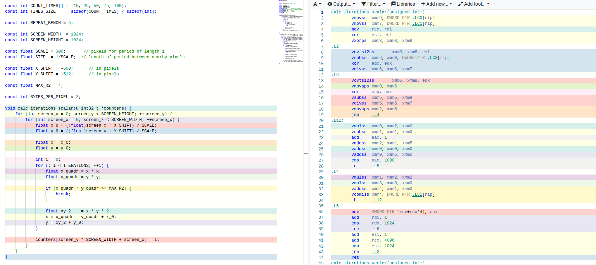

# Оптимизация вычисления цветов для отрисовки множества Мандельброта

## Множество Мандельброта


Рассмотрим действительную плоскость и точку из области построения на ней. Координаты точки будем обозначать как $x_0$ и $y_0$. Для каждой точки рассмотрим последовательность, каждый следующий элемент которой будет вычисляться по формуле:

$$y_{i+1} = 2 x_i y_i + x_0$$

$$x_{i+1} = x_i^2 - y_i^2 + y_0$$

Зададим для наших последовательностей максимальный радиус удаления от начала координат. Тогда для некоторых начальных точек последовательности всегда будут лежать внутри области, ограниченной максимальным радиусом. Другие же последовательности способны выходить за её пределы. Для визуализации плоскости будем использовать номер итерации, на которой произойдет выход, в качестве параметра для вычисления цвета. Ограничим число итераций для вычисления некоторой константой, и в случае, если за определенное нами количество повторений выхода не произойдет, будем останавливать цикл и красить точку в цвет, соответствующий ограничивающей константе.

В данной задаче мы будем отрисовывать множество Мандельброта, оптимизируя функцию вычисления количества итераций, необходимых для выхода последовательности за пределы максимального радиуса удаления. Рисование будет происходить при помощи графической библиотеки SDL2.

## Общая информация

Характеристики ноутбука:

| Характеристики |                    |
|----------------|--------------------|
| OS             | Linux Mint 21      |
| CPU            | AMD Ryzen 7 5800H  |
| Compiler       | gcc 11.3.0         |

Флаги для сборки:
`-O3 -mtune=native -flto -mavx -mavx2`

Измерения производятся при полной зарядке ноутбука с питанием от сети, параллельно никаких действий на ноутбуке не выполнется.

### Измерение времени

Измерение времени производится для функции вычисления количества иттераций, необходимого точкам для того, чтобы их последовательности вышли за пределы заданной области. Функция имеет прототип `void (*get_pixels)(u_int32_t *counters)` и при помощи двойного цикла записывает в полученный массив значения для всех точек экрана.

Вычисление значений массива производится несколько раз вподряд путем повторного вызова функции вычисления, измеряется суммарное время для всех вызовов, после чего отрисовка производится один раз. Значение числа вызовов определяется константами, которые будут указаны далее, измерения производятся для нескольких вариантов значений. Так же для повышения точности время усредняется по нескольким измерениям, вычисляется среднее отклонение от среднего значения. 

### Константы для вычислений
Константы определены в заголовочном файле `common.h`.

Максимальное количество иттераций вычисления точки последовательности, после которого вычисление прекращается:

```c++
const int ITERATIONS  = 1000;
```

Количество повторений вычисления значений массива между отрисовками и размер массива различных вариантов повторений:
```c++
const int COUNT_TIMES[] = {10, 25, 50, 75, 100};
const int TIMES_SIZE = sizeof(COUNT_TIMES) / sizeof(int);
```
Количество повторения измерений для усреднения:

```c++
const int REPEAT_BENCH = 5;
```

Параметры экрана в пикселях:
```c++
const int SCREEN_WIDTH  = 1024;
const int SCREEN_HEIGHT = 1024;
```

Параметры масштабирования - количество пикселей в 1 единице длины, количество единиц длины между пикселями:
```c++
const float SCALE = 300;
const float STEP  = 1/SCALE;
```
Смещение начала координат относительно верхнего левого угла в пикселях:
```c++
const float X_SHIFT = -600;      // in pixels
const float Y_SHIFT = -512;      // in pixels
```
Максимальный радиус удаления точки от начала координат в единицах длины:
```c++
const float MAX_R2 = 4;
```
Количество байт, необходимое для кодирования пикселя. Для отображения используется палитра RGB:
```c++
const int BYTES_PER_PIXEL = 3;
```
### Рисование
Для отрисовки используется графическая библиотека SDL2. В функции `run_mandelbrote` создается массив переменных типа `u_int32_t`, в который функция `void (*get_pixels)(u_int32_t *counters)` запишет значения необходимого для выхода количества итераций для всех точек. Так же создается массив переменных типа `u_int8_t`, являющихся значениями цветов для пикселей - за пиксель с номером `i` будут отвечать `3i`, `3i+1` и `3i+2` элементы массива, кодируя цвета `R`, `G` и `B` соответственно. Вычисление значений цветов пикселей производится в функции `static void calc_colors(u_int8_t *screen, u_int32_t *counters)`, записывающей соответствующие значения в переданный массив `screen`. Формулы для вычисления цветов в текущей палитре:

```c++
screen[pos_in_screen + 0] = (counter * 256 * 128 / ITERATIONS) % 256;
screen[pos_in_screen + 1] = (counter * 256 * 128 / ITERATIONS) % 256;
screen[pos_in_screen + 2] = (counter * 256 * 128 / ITERATIONS) % 256;
```
где `pos_in_screen` является позицией начала байт обрабатываемого сейчас пикселя в массиве `screen`, переменная `counter` является количеством итераций, потребовавшимся для выхода последовательности за границы области.

Вывод получившегося массива на экран производится путем загрузки массива пикселей в текстуру и её рендеринга:

```c++
int   pitch  = 0;
void *pixels = nullptr;

SDL_LockTexture(window->tex, NULL, &pixels, &pitch);
memcpy(pixels, picture, SCREEN_HEIGHT * SCREEN_HEIGHT * BYTES_PER_PIXEL);
SDL_UnlockTexture(window->tex);

SDL_RenderClear(window->ren);
SDL_RenderCopy(window->ren, window->tex, NULL, NULL);
SDL_RenderPresent(window->ren);
```

## Наивная реализация

Исходный код находится в файле `src/mandelbrot1.cpp`. Для вычисления используется функция `void calc_iterations_1(u_int32_t *counters)`, соответствующая прототипу для вызова из функций измерения времени и отрисовки. Суть реализации: двойной цикл по ширине и высоте экрана, на каждом шаге при помощи цикла вычисляется номер элемента, впервые вышедшего за границы области. Вычисление производится в соответствии с приведенными в начале формулами:

```c++
float x_0 = ((float)screen_x + X_SHIFT) / SCALE;  // начальная позиция точки
float y_0 = ((float)screen_y + Y_SHIFT) / SCALE; // в единицах измерения длины

float x = x_0;   // нулевой элемент последовательности -
float y = y_0;  // - координаты начальной точки

int i = 0;
for (; i < ITERATIONS; ++i) { // цикл вычисления последующих членов
    float x_quadr = x * x;
    float y_quadr = y * y;
    float xy_2    = x * y * 2;

    if (x_quadr + y_quadr >= MAX_R2) { // проверка выхода за границы области
        break;
    }

    x = x_quadr - y_quadr + x_0;   // вычисление следующего элемента
    y = xy_2 + y_0;               // последовательности по формуле
}

counters[screen_y * SCREEN_WIDTH + screen_x] = i; // сохранение номера остановки
```

## Оптимизация при помощи AVX/AVX2 intrinsics

Для оптимизации значения вычислялись группами по 8 точек одновременно. Для этого точки хранились в переменной типа `__m256`, объединяющей в себе 8 значений типа `float`.
Вычисления для набора точек продолжались пока хотя бы одна точка оставалась в пределах границ области максимального удаления. При этом на каждом шаге использовалась функция `_mm256_cmp_ps`, проверяющая для каждого из восьми квадратов расстояния не превосходит ли он радиус максимального удаления, и возвращающая переменную типа `__m256` 8 значений `0` и `-1` в зависимости от результата. Это значение вычиталось из общего счетчика. Таким образом в случае, если одна из точек выходила за границы области, значение её счетчика прекращало меняться. После выхода всех точек или достижения максимального количества итерации цикла, вычисление прекращалось и 8 значений записывались в массив при помощи функции `_mm256_store_si256`. 

Таким образом все операции с точками внутри измеряемой функции стали производиться с восемью точками одновременно вместо действий с каждой точкой по отдельности, что приводит к ожидаемому ускорению в 8 раз.

Сравним, что происходит внутри циклов прохода по длине и ширине в неоптимизированном и оптимизированном случае соответственно:

https://godbolt.org/z/E8P6bcoqb




В первом случае `xmm` регистры используются для одного числа, то есть компилятор не векторизует цикл даже в случае `-O3` флага. Во втором же случае целиком используются регистры `ymm` и инструкции к ним, то есть оптимизация действительно срабатывает.

Ещё интересное наблюдение: компилятор переставляет операции внутри цикла так, чтобы перед проверками стояли необходимые для них вычисления. Таким образом, в некоторых случаях, если произойдет выход из цикла, вычисление значений переменных, не используемых вне цикла, не произойдет.

## Результаты измерения времени

Так как время исполнения программы зависит от состояния компьютера, запуск измеряющей программы для обеих программ был произведен трижды, программы чередовались. Для определения влияния внешних к программе факторов были построены графики всех трех запусков для первой и второй программы:


На графиках отражена зависимость времени работы функции, запущенной `COUNT_TIMES` раз вподряд, от значения `COUNT_TIMES`.

Как видно из графиков, значения для трех запусков отличаются незначительно, а значит изменения внешних факторов так же незначительны. Таким образом сравнение результатов двух версий, запускавшихся не одновременно, корректно.

Результаты сравнений:


Коэффициенты прямых при аппроксимации уравнением $y = kx + b$ следующие:
| m | k   | b |
|---|-----|---|
| 1 | 332 | 6 |
| 2 |  45 | 4 |

Соотношение коэффициентов: $7.39$. При этом смещение показывает ожидаемое время работы функции при нулевом количестве повторений, то есть показывает затраты на действия, не связанные с её вызовом, например на использование `volatile` переменной с целью предотвращения пропуска цикла оптимизатором. 

Значение $8$ не достигается, в частности, из-за таких затрат, а так же затрат на вызов функции и возвращение из неё. Так же влияет то, что для некоторых точек цикл продолжается в том числе после того, как они вышли за границу максимального удаления, а значит экономится не полное время на эти точки, а лишь его часть. Поясним это на примере:

> Пусть в наборе 8 точек, и 4 из них выходят за границы нашей области за 50 иттераций цикла, а оставшиеся 4 за 100 иттераций. Тогда в наивной реализации потребуется $50 * 4 + 100 * 4 = 600$ иттераций, а в оптимизированной $100$, так как цикл не остановится, пока за пределы не выйдут все точки. Таким образом реальное ускорение произойдет в $6$ раз для конкретно этого набора. 

Идеальный случай с ускорением в $8$ раз достигается в случае, если 8 точек в наборе имеют одинаковые или очень близкие значения количества итераций, необходимых для выхода. Результат $7.31$ получился достаточно хорошим за счет того, что лежащие рядом точки в достаточно большом количестве случаев будут иметь близкие значения - например во всех черных и всех белых областях.