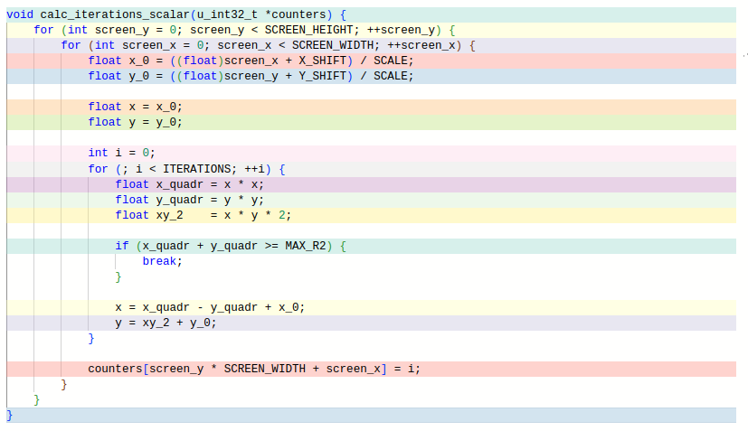

# Оптимизация вычисления цветов для отрисовки множества Мандельброта

## Множество Мандельброта


Рассмотрим действительную плоскость и точку из области построения на ней. Координаты точки будем обозначать как $x_0$ и $y_0$. Для каждой точки рассмотрим последовательность, каждый следующий элемент которой будет вычисляться по формуле:

$$y_{i+1} = 2 x_i y_i + x_0$$

$$x_{i+1} = x_i^2 - y_i^2 + y_0$$

Зададим для наших последовательностей максимальный радиус удаления от начала координат. Тогда для некоторых начальных точек последовательности всегда будут лежать внутри области, ограниченной максимальным радиусом. Другие же последовательности способны выходить за её пределы. Для визуализации плоскости будем использовать номер итерации, на которой произойдет выход, в качестве параметра для вычисления цвета. Ограничим число итераций для вычисления некоторой константой, и в случае, если за определенное нами количество повторений выхода не произойдет, будем останавливать цикл и красить точку в цвет, соответствующий ограничивающей константе.

В данной задаче мы будем отрисовывать множество Мандельброта, оптимизируя функцию вычисления количества итераций, необходимых для выхода последовательности за пределы максимального радиуса удаления. Рисование будет происходить при помощи графической библиотеки SDL2.

## Общая информация

Характеристики ноутбука:

| Характеристики |                    |
|----------------|--------------------|
| OS             | Linux Mint 21      |
| CPU            | AMD Ryzen 7 5800H  |
| Compiler       | gcc 11.3.0         |

Флаги для сборки:
`-O3 -mavx -mavx2`

Измерения производятся при полной зарядке ноутбука с питанием от сети, параллельно никаких действий на ноутбуке не выполнется.

### Измерение времени

Измерение времени производится для функции вычисления количества итераций, необходимого точкам для того, чтобы их последовательности вышли за пределы заданной области. Функция имеет прототип `void (u_int32_t *counters)` и при помощи двойного цикла записывает в полученный массив значения для всех точек экрана.

Вычисление значений массива производится несколько раз вподряд путем повторного вызова функции вычисления, измеряется суммарное время для всех вызовов. Значение числа вызовов определяется константой `COUNT_TIMES`. Так же для повышения точности время усредняется по нескольким измерениям, вычисляется среднеквадратичное значение. Отрисовка производится перед началом измерений по однократному вызову функции для проверки корректности её работы, после чего происходит снова после окончания вычислений.

### Константы для вычислений
Константы определены в заголовочном файле `common.h`.

| тип          | имя             | значение             | смысл |
|--------------|-----------------|----------------------|-------|
| const int    | ITERATIONS      | 1000                 | Максимальное количество итераций вычисления точки последовательности, после которого вычисление прекращается.
| const int    | COUNT_TIMES     | 50                   | Количество повторений вычисления значений массива между включением и остановкой таймера.
| const int    | REPEAT_BENCH    | 10                   | Количество повторения измерений для усреднения.
| const int    | SCREEN_WIDTH    | 1000                 | Ширина экрана в пикселях
| const int    | SCREEN_HEIGHT   | 1000                 | Высота экрана в пикселях
| const float  | SCALE           | 300                  | Параметр масштабирования - количество пикселей в 1 единице длины.
| const float  | STEP            | 1/SCALE = 1/300      | Параметр масштабирования - количество единиц длины между пикселями.
| const float  | X_SHIFT         | -600                 | Смещение начала координат относительно верхнего левого угла в пикселях.
| const float  | Y_SHIFT         | -512                 |  Смещение начала координат относительно верхнего левого угла в пикселях.
| const float  | MAX_R2          | 4                    | Максимальный радиус удаления точки от начала координат в единицах длины.
| const int    | BYTES_PER_PIXEL | 3                    | Количество байт, необходимое для кодирования пикселя. Для отображения используется палитра RGB.


### Рисование
Для отрисовки используется графическая библиотека SDL2. В функции `run_mandelbrote` создается массив переменных типа `u_int32_t`, в который функция `void get_pixels(u_int32_t *counters)` запишет значения необходимого для выхода количества итераций для всех точек. Так же создается массив переменных типа `u_int8_t`, являющихся значениями цветов для пикселей - за пиксель с номером `i` будут отвечать `3i`, `3i+1` и `3i+2` элементы массива, кодируя цвета `R`, `G` и `B` соответственно. Вычисление значений цветов пикселей производится в функции `static void calc_colors(u_int8_t *screen, u_int32_t *counters)`, записывающей соответствующие значения в переданный массив `screen`. Формулы для вычисления цветов в текущей палитре:

```c++
screen[pos_in_screen + 0] = (counter * 256 * 128 / ITERATIONS) % 256;
screen[pos_in_screen + 1] = (counter * 256 * 128 / ITERATIONS) % 256;
screen[pos_in_screen + 2] = (counter * 256 * 128 / ITERATIONS) % 256;
```
где `pos_in_screen` является позицией начала байт обрабатываемого сейчас пикселя в массиве `screen`, переменная `counter` является количеством итераций, потребовавшимся для выхода последовательности за границы области.

Вывод получившегося массива на экран производится путем загрузки массива пикселей в текстуру и её рендеринга:

```c++
int   pitch  = 0;
void *pixels = nullptr;

SDL_LockTexture(window->tex, NULL, &pixels, &pitch);
memcpy(pixels, picture, SCREEN_HEIGHT * SCREEN_HEIGHT * BYTES_PER_PIXEL);
SDL_UnlockTexture(window->tex);

SDL_RenderClear(window->ren);
SDL_RenderCopy(window->ren, window->tex, NULL, NULL);
SDL_RenderPresent(window->ren);
```

## Скалярная реализация

Так же будет использоваться название наивная реализация.

Исходный код находится в файле `src/scalar.cpp`. Для вычисления используется функция `void calc_iterations_scalar(u_int32_t *counters)`, соответствующая прототипу для вызова из функций измерения времени и отрисовки. Суть реализации: двойной цикл по ширине и высоте экрана, на каждом шаге при помощи цикла вычисляется номер элемента, впервые вышедшего за границы области. Вычисление производится в соответствии с приведенными в начале формулами:

```c++
for (int screen_y = 0; screen_y < SCREEN_HEIGHT; ++screen_y) {
    for (int screen_x = 0; screen_x < SCREEN_WIDTH; ++screen_x) {
        float x_0 = ((float)screen_x + X_SHIFT) / SCALE;  // начальная позиция точки
        float y_0 = ((float)screen_y + Y_SHIFT) / SCALE; // в единицах измерения длины

        float x = x_0;   // нулевой элемент последовательности -
        float y = y_0;  // - координаты начальной точки

        int i = 0;
        for (; i < ITERATIONS; ++i) { // цикл вычисления последующих членов
            float x_quadr = x * x;
            float y_quadr = y * y;
            float xy_2    = x * y * 2;

            if (x_quadr + y_quadr >= MAX_R2) { // проверка выхода за границы области
                break;
            }

            x = x_quadr - y_quadr + x_0;   // вычисление следующего элемента
            y = xy_2 + y_0;               // последовательности по формуле
        }

        counters[screen_y * SCREEN_WIDTH + screen_x] = i; // сохранение номера остановки
    }
}
```

### Оптимизация вынесения повторного вычисления одного значения за пределы цикла

Заметим, что во внутреннем цикле значение `y_0` вычисляется на каждой итерации. Такое вычисление является избыточным в силу того, что на каждой итерации внешнего цикла значение `screen_y` постоянно, а значит вычисление вертикальной можно вынести за пределы внутреннего цикла. Посмотрим, как поступает в данной ситуации компилятор:




Посмотрим на момент сравнения значения `screen_x` с `SCREEN_WIDTH`:

```assembly
add     rdx, 1
cmp     rdx, 1024
jne     .L6
```

Переход происходит на метку `.L6`. Как видно на скриншотах выше, данная метка располагается ниже вычисления значения `y_0`, что значит, что компилятор самостоятельно справился с вынесением вычисления за пределы внутреннего цикла. При проверке других уровней оптимизации (скриншоты для них не приведены здесь в силу того, что измерения будут производиться на `-O3`), было выяснено, что данную оптимизацию компилятор выполняет так же с флагами `-O2` и `-O1`, и не выполняет исключительно при полном отсутствии оптимизаций. Таким образом, выносить вычисление за пределы функции не обязательно, и мы сохраним вычисление в теле цикла для повышения читаемости. В векторной реализации мы не будем заострять внимание на этой оптимизации, считая, что компилятор справится с ней самостоятельно.

### Оптимизация переставлением команд местами

Наблюдение: компилятор переставляет операции внутри цикла так, чтобы перед проверками стояли необходимые для них вычисления. Те же вычисления, которые могут не потребоваться в случае выхода из цикла, окажутся ниже проверки. Например для кода:
```c++
float x_quadr = x * x;
float y_quadr = y * y;
float xy_2    = x * y * 2;

if (x_quadr + y_quadr >= MAX_R2) {
    break;
}
```

Компилятор выдает код на ассемлере:
```assembly
vmulss  xmm3, xmm0, xmm0
vmulss  xmm1, xmm2, xmm2
vmulss  xmm0, xmm2, xmm0
vaddss  xmm2, xmm1, xmm3
vcomiss xmm2, DWORD PTR .LC2[rip]
vaddss  xmm0, xmm0, xmm0
jb      .L12
```

Таким образом, выражение $2xy$ раскрывается в вычисление произведения $xy$, после чего происходит проверка на выход за границы, и после этого происходит сложение $xy + xy$. Операция умножения чисел с плавающей точкой заменяется на более простое сложение, которое выполняется только в случае, если выход из цикла не произойдет. 

При этом компилятор справляется с задачей не идеально, так как перенести умножение $x*y$ тоже можно было бы. Так и поступим, переместив вычисление $2xy$ ниже проверки на выход из цикла во всех реализациях.

## Векторизация при помощи AVX/AVX2 intrinsics

Для оптимизации значения вычислялись группами по 8 точек одновременно. Для этого точки хранились в переменной типа `__m256`, объединяющей в себе 8 значений типа `float`.
Вычисления для набора точек продолжались пока хотя бы одна точка оставалась в пределах границ области максимального удаления. При этом на каждом шаге использовалась функция `_mm256_cmp_ps`, проверяющая для каждого из восьми квадратов расстояния, не превосходит ли он радиус максимального удаления, и возвращающая переменную типа `__m256`. Переменная содержала в себе 8 значений `0` и `-1`, означающих превышение и отсутствие превышения максимального радиуса соответственно. Это значение вычиталось из общего счетчика. Таким образом в случае, если одна из точек выходила за границы области, значение её счетчика прекращало меняться. После выхода всех точек или достижения максимального количества итерации цикла, вычисление прекращалось и 8 значений записывались в массив при помощи функции `_mm256_store_si256`. 

### Анализ кода

Сравним, что происходит внутри циклов прохода по длине и ширине в неоптимизированном и оптимизированном случае соответственно:

https://godbolt.org/z/E759KjoqW


Оптимизация арифметики до/после:

```assembly
vmulss  xmm3, xmm0, xmm0
vmulss  xmm1, xmm2, xmm2
vmulss  xmm0, xmm2, xmm0
```

```assembly
vmulps  ymm11, ymm0, ymm0
vmulps  ymm2, ymm1, ymm1
vmulps  ymm0, ymm1, ymm0
```

При вычислении квадратов $x$ и $y$ и значения $2xy$ в первом случае `xmm` регистры используются для одного числа, то есть компилятор не векторизует цикл даже в случае `-O3` флага. Во втором же случае целиком используются регистры `ymm` и инструкции к ним, то есть оптимизация действительно срабатывает.

### Оценка времени

Все операции с точками внутри измеряемой функции стали производиться с восемью точками одновременно вместо действий с каждой точкой по отдельности, что значит, что идеальным значением ускорения было бы ускорение в 8 раз.

При этом реальное ускорение должно быть немного меньше $8$. Действительно, для некоторых точек цикл будет продолжать исполнятся несмотря на то, что они уже вышли за границы. Таким образом, экономия времени будет меньшей, чем в $8$ раз, так как в скалярном варианте было затрачено менее, чем 8 * время на набор из 8 точек. Покажем на примере:

> Пусть в наборе 8 точек, и 4 из них выходят за границы нашей области за 50 итераций цикла, а оставшиеся 4 за 100 итераций. Тогда в наивной реализации потребуется $50 * 4 + 100 * 4 = 600$ итераций. В векторной при этом потребуется $100$ итераций, так как цикл не остановится, пока за пределы не выйдут все точки. Таким образом реальное ускорение произойдет в $6$ раз для конкретно этого набора. 

При этом для множества Мандельброта соседние точки в большинстве случаев имеют близкий цвет, что значит, что ускорение должно получиться близким к числу $8$.

## Измерение времени

### Влияние многократного вызова функции

Предположение: многократный вызов функции и использование volatile переменной для предотвращения пропуска цикла может повлиять на время.

Проверим предположение, вызывая пустую функцию, и измерив её время выполнения. Код будет выглядеть так:

```c++ 
__attribute__((noinline)) void calc_iterations_scalar(u_int32_t *counters) {
    volatile int i = 0;
}

void run_mandelbrote(void (*get_pixels)(u_int32_t *counters)) {
    Window *window = window_init();
    u_int32_t *counters = (u_int32_t*) aligned_alloc(32, SCREEN_HEIGHT * SCREEN_WIDTH * sizeof(u_int32_t));
    u_int8_t  *screen   =  (u_int8_t*) calloc(SCREEN_HEIGHT * SCREEN_WIDTH * BYTES_PER_PIXEL, sizeof(u_int16_t));

    Time time = {};

    time = get_time(COUNT_TIMES, counters, get_pixels);
    print_time(time);

    end_window(window);

    free(counters);
    free(screen);
}

static Time get_time(int count_times, u_int32_t *counters, void (*get_pixels)(u_int32_t *counters)) {
    long times[REPEAT_BENCH] = {};
    volatile u_int32_t avoid_skip_loop_optimization = 0;

    for (int i = 0; i < REPEAT_BENCH; ++i) {
        clock_t begin = clock();
        for (int j = 0; j < count_times; ++j) {
            get_pixels(counters);
            avoid_skip_loop_optimization = counters[j];
        }
        clock_t end = clock();

        float time = end - begin;
        time = (time * 1000) / (CLOCKS_PER_SEC); // time in msec 

        times[i] = time;
    }

    Time time = {};
    for (int i = 0; i < REPEAT_BENCH; ++i) {
        time.time += times[i];
    }
    time.time /= REPEAT_BENCH;
    for (int i = 0; i < REPEAT_BENCH; ++i) {
        float delta = (times[i] - time.time);
        time.error += delta * delta;
    }
    time.error /= REPEAT_BENCH;
    time.error = sqrt(time.error);

    return time;
}
```
Проверим на более простом примере в godbolt, что пропуск вызова не производится:


Проведем измерения, установив константу `COUNT_TIMES` равной $1.000.000$. В таком случае программа выводит значения $time = 1.060000$, $error = 0.237487$. Таким образом на $10^7$ вызовов тратится $1.1 \pm 0.2$ милисекунды, что говорит о том, что затраты на вызов функции незначительны по сравнению с вычислениями в ней. Вернем код в исходное состояние, чтобы произвести измерения времени работы функции.

### Измерения 

Так как время исполнения программы зависит от состояния компьютера, запуск измеряющей программы для обеих программ был произведен трижды, программы чередовались. Ниже приведены значения времени для $50$ последовательных вызовов программы, усредненные по 10 повторениям и погрешность, расчитанная как среднеквадратичное отклонение.

Скалярная реализация:

| номер запуска | затраченное время, ms | погрешность, ms |
|---------------|-----------------------|-----------------|
| 1             | 16830                 | 50              |
| 2             | 16710                 | 40              |
| 3             | 16800                 | 40              |

Векторная реализация:

| номер запуска | затраченное время, ms | погрешность, ms |
|---------------|-----------------------|-----------------|
| 1             | 2258                  | 3               |
| 2             | 2258                  | 3               |
| 3             | 2300                  | 5               |

Мы видим, что времена для соседних запусков отличаются незначительно по сравнению с величиной времени (составляет около процента), что значит, что сравнение запущенных не одновременно программ корректно. Так же можно убедиться, что время, затраченное на вызов функции незначительно. Средние значения:

| реализация | время на 50 запусков, ms | время на один запуск, ms | погрешность времени на один запуск, ms |
|------------|--------------------------|--------------------------|----------------------------------------|
| скалярная  | 16780                    | 335.6                    | 0.9                                    |
| векторная  | 2272                     | 45.44                    | 0.07                                   |

Соотношение времен: $7.39$, что подтверждает теоретические рассуждения.